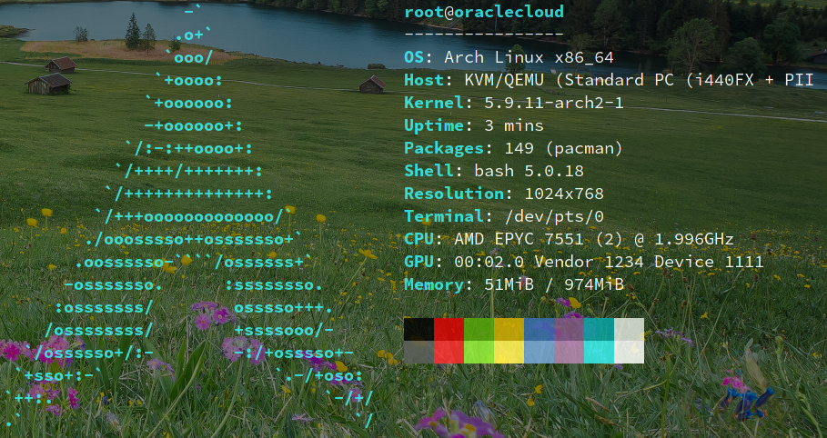

## 前言

本人对比较喜欢`ArchLinux`，使用的`vps`基本对会使用[vps2arch](https://github.com/felixonmars/vps2arch)脚本，将系统变更为`ArchLinux`。今天从`OracleCloud`薅羊毛，得到永久免费`vps`，自然想安装`ArchLinux`，但`OracleCloud`使用的是`UEFI`启动方式，vps2arch 脚本不再适用，不得不手动安装，特此记录。

实际上，与在已有系统安装`ArchLinux`类似，区别仅仅是安装位置是原系统所在分区，安装前需删除原系统数据。

## 前期准备

- 查询设备UUID信息

> blkid

```
/dev/sda1: LABEL="cloudimg-rootfs" UUID="206a406e-5432-46e5-82b5-66bed63992ba" BLOCK_SIZE="4096" TYPE="ext4" PARTUUID="0b4f381f-b07c-435c-8947-0d6e545b4518"
/dev/sda14: PARTUUID="ea7c39ab-f4de-475b-b996-0617a04d4705"
/dev/sda15: LABEL_FATBOOT="UEFI" LABEL="UEFI" UUID="0100-A4A7" BLOCK_SIZE="512" TYPE="vfat" PARTUUID="1307abb3-75dd-4990-82f8-48bb2d69c5da"
```

- 查询设备分区信息

> lsblk

```
NAME    MAJ:MIN RM  SIZE RO TYPE MOUNTPOINT
sda       8:0    0 46.6G  0 disk 
|-sda1    8:1    0 46.5G  0 part /
|-sda14   8:14   0    4M  0 part 
`-sda15   8:15   0  106M  0 part /boot
```

## 创建chroot环境

- 下载并解压bootstrap（因本人选择的大阪机房，所以选择日本的源）

```
cd /tmp
wget http://mirrors.cat.net/archlinux/iso/latest/archlinux-bootstrap-2020.12.01-x86_64.tar.gz
tar xzf archlinux-bootstrap-*-x86_64.tar.gz
```

- 选择源

```
echo http://mirrors.cat.net/archlinux/$repo/os/$arch' > root.x86_64/etc/pacman.d/mirrorlist
```

- chroot
  
```
/tmp/root.x86_64/bin/arch-chroot /tmp/root.x86_64/
```

## 使用chroot环境安装系统

- 初始化 pacman keyring

```
pacman-key --init
pacman-key --populate archlinux
```

- 挂载设备（最好和原系统保持一致）

```
mount /dev/sda1 /mnt
mount /dev/sda15 /mnt/boot
```

- 删除旧系统

因为是在原系统上安装`AchLinux`，所以要删除原系统中的文件，但全删除后系统异常，无法继续安装，所以需保留必要文件。以下目录需保留，其余文件可全部删除。

| 目录                | 说明                             |
| ------------------- | -------------------------------- |
| boot                | 保留目录即可，内部文件可全部删除 |
| tmp                 | bootstrap正在使用，不可删除      |
| dev、proc、run、sys |                                  |

```
cd /mnt
ls | grep -vE 'boot|tmp|dev|proc|run|sys' | xargs rm -rf
rm -rf boot/*
```

- 安装基础系统

```
pacstrap /mnt base base-devel linux linux-firmware nano neofetch
```

- 创建fstab

创建后需进行检查，务必确保正确。

```
genfstab -U /mnt >> /mnt/etc/fstab
```

- chroot，进入目标系统
  
```
arch-chroot /mnt
```

## 完善系统

- 时区，此处选择东八区

```
ln -sf /usr/share/zoneinfo/Asia/Shanghai /etc/localtime
hwclock --systohc
```
- 本地化

```
echo 'en_US.UTF-8 UTF-8' > /etc/locale.gen
locale-gen
echo 'LANG=en_US.UTF-8' > /etc/locale.conf
```

- 网络设置

```
echo 'oraclecloud' > /etc/hostname

cat << EOF > /etc/hosts
127.0.0.1   localhost
::1         localhost
127.0.1.1   oraclecloud.localdomain   oraclecloud
EOF

cat << EOF > /etc/systemd/network/20-wired.network
[Match]
Name=ens3
[Network]
DHCP=ipv4
EOF

systemctl enable systemd-networkd
```

- SSH

在 /etc/ssh/sshd_config 变更以下设置

```
PermitRootLogin yes
ClientAliveInterval 60
ClientAliveCountMax 360
```

创建 /root/.ssh/authorized_keys 文件，添加个人的 id_rsa.pub ，并设置文件权限为0600。

自启动sshd

```
systemctl enable sshd
```

- 设置boot

本人喜欢 systemd-boot ，所以使用它作为启动引导。

```
bootctl install
```

配置 loader.conf 和 arch.conf 文件

```
cat << EOF > /boot/loader/loader.conf
timeout       2
default       arch
console-mode  auto
EOF

cat << EOF > /boot/loader/entries/arch.conf
title   Arch Linux
linux   /vmlinuz-linux
initrd  /initramfs-linux.img
options root="UUID=206a406e-5432-46e5-82b5-66bed63992ba"  rw
EOF
```

- 设置root密码

```
passwd
```

## 进入新系统

连续输入两次 exit 退出到原系统， 然后 reboot 重启，等待几分钟后，重新连接ssh,进入则表明重装成功。

