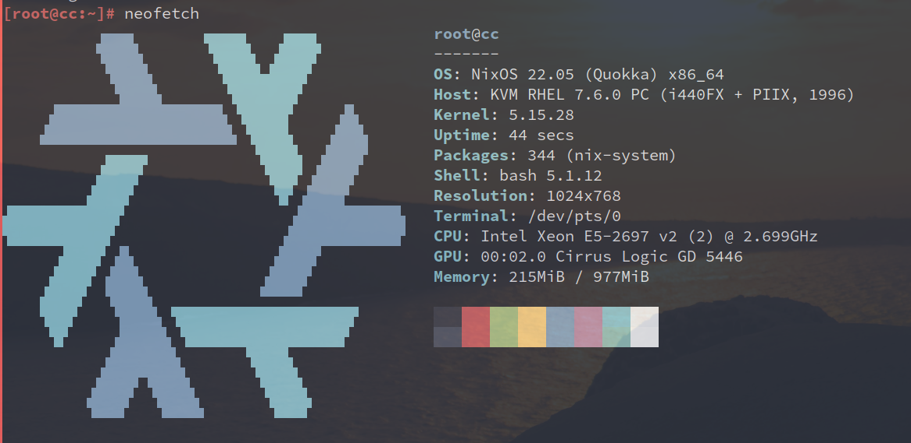

## 前言

最近改用`nixos`，当然希望vps也能安装相同的系统。`virmach`家可通过`netboot,xyz`安装，比较方便。但手上有一台vps,商家只支持`debian`和`centos`，只能自己想办法安装。

## 内存安装最小化系统

此处使用的是[menhera.sh](https://github.com/Jamesits/menhera.sh)方案，在使用前记得备份好网络等重要信息。

```bash
wget https://raw.githubusercontent.com/Jamesits/menhera.sh/master/menhera.sh
chmod +x menhera.sh
./menhera.sh
```

根据提示即可安装成功，然后重启进入新系统。

## 准备环境

查看磁盘挂载情况，旧系统根目录挂载在`/mnt/oldroot`,删除磁盘原有文件。同时防止内存不足，将/nix挂载到硬盘，如果有交换区，可以开启。

```bash
rm -rf /mnt/oldroot/*
mkdir /mnt/oldroot/xxx
mkdir /nix
mount -o bind /mnt/oldroot/xxx /nix
swapon /dev/vda2
```

安装必要的工具。

```bash
apt update
apt install -y wget curl xz-utils sudo git nano
```

创建相关组和用户

```bash
groupadd -g 30000 nixbld
useradd -m -u 30000 -g nixbld -G nixbld -s /bin/bash nixbld
```

`nixbld`用户添加`sudo`权限，并添加`nixUnstable`配置，同时变更/nix所属

```bash
echo "nixbld  ALL=(ALL) NOPASSWD: ALL" >> /etc/sudoers
mkdir -p /etc/nix
echo "experimental-features = nix-command flakes" > /etc/nix/nix.conf
chown -R nixbld /nix
```

切换至`nixbld`用户

```bash
su nixbld
cd ~
```

## 安装`nix`工具和新系统

~~此处使用[nix-unstable-installer](https://github.com/numtide/nix-unstable-installer)方案。~~

官方稳定版已经支持`nix flake`。

```bash
curl -L https://nixos.org/nix/install | sh
. $HOME/.nix-profile/etc/profile.d/nix.sh
```

更新channel

```
nix-channel --update
```

安装`nixos-install-tools`

```bash
nix-env -f '<nixpkgs>' -iA nixos-install-tools
```

创建配置文件，配置文件默认安装在`/mnt/etc/nixos`（可选,注意：此处UUID错误，需要修改）

```bash
sudo `which nixos-generate-config` --root /mnt/oldroot
```

因为我已经提前准备好配置，所以不需要上一步，或者仅需要上一步产生的`hardware-configuration.nix`，修改好配置后进行安装。

```bash
git clone git@github.com:ZenQy/nixos.git
cd nixos
cp /mnt/oldroot/etc/nixos/hardware-configuration.nix host/cc/hardware.nix
sudo PATH="$PATH" `which nixos-install` --root /mnt/oldroot --flake .#cc
```

如果安装时报错，无需担心，重新切换到nixbld用户，再次安装即可成功。
重启即可进入新系统，重启前可以考虑把配置文件转移到新系统中,重启后记得删除/xxx文件夹。

```bash
cd ../
sudo mv nixos /mnt/root/
```



## 常见问题

1. ailed to create file via template ‘/tmp/tmp.XXXXXXXXXX’: No such file or directory
答：手动创建/tmp文件夹

2. chroot: failed to run command ‘systemd-tmpfiles’: No such file or directory
答：没找到解决方案，有时不影响，可以成功进入系统，有时却不可以

3. nixos-install 过程中直接killed
答：系统内存不足，不用官方ubuntu系统，改用debian、arch或nixos就能成功