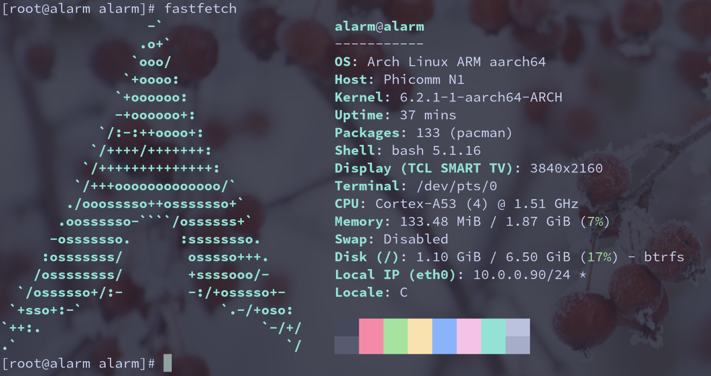

## 前言

**Phicomm N1**是非常热门的盒子，其`OpenWrt`和`Armbian`的资源非常丰富。之前我的N1盒子一直运行`OpenWrt`，但`OpenWrt`内核无法运行`dae`（至少我没能打包出支持bpf的内核），`sing-box`的前端我不太喜欢，因此有了更换系统的想法。

## 整体思路

因为`s905`的分区比较复杂，我不敢直接操作，因此想先在`emmc`上安装`Armbian`，保留启动文件，删除其他文件，再将`ArchLinuxARM`的文件解压到相应位置，完成安装。

## 制作U盘

可以在[ophub](https://github.com/ophub/amlogic-s9xxx-armbian/releases/)上下载`Armbian`镜像，比如：[Armbian_24.2.0_amlogic_s905d_jammy_6.6.11_server_2024.01.13.img.g](https://github.com/ophub/amlogic-s9xxx-armbian/releases/download/Armbian_jammy_save_2024.01/Armbian_24.2.0_amlogic_s905d_jammy_6.6.11_server_2024.01.13.img.gz)，解压后DD到U盘
```bash
gzip -d Armbian_24.2.0_amlogic_s905d_jammy_6.6.11_server_2024.01.13.img.gz
sudo dd if=Armbian_24.2.0_amlogic_s905d_jammy_6.6.11_server_2024.01.13.img of=/dev/sda status=progress
```

## 写入EMMC

插入U盘后通电，盒子会正常启动并进入系统，默认用户名：root,默认密码：1234，然后通过`Armbian`自带的命令写入EMMC
```bash
armbian-install
```

## 保留必要文件

写入完成后，挂载EMMC
```bash
mount /dev/mmcblk1p2 /mnt
mount /dev/mmcblk1p1 /mnt/boot
```
保留`/mnt/etc/fstab`和`/mnt/boot/uEnv.txt`文件，其余文件全部删除

## 解压ArchLinuxARM压缩包

下载[ArchLinuxARM-aarch64-latest.tar.gz](https://mirrors.ustc.edu.cn/archlinuxarm/os/ArchLinuxARM-aarch64-latest.tar.gz)并解压到挂载位置
```bash
tar -xpf ArchLinuxARM-aarch64-latest.tar.gz -C /mnt
```
并用保留的`/mnt/etc/fstab`替换当前的，文件内容大概如下所示：
```txt
UUID=8128419f-7683-4714-bf23-5c08482da669    /        btrfs    defaults,noatime,compress=zstd:6      0 1
LABEL=BOOT_EMMC        /boot    vfat                   defaults                   0 2
tmpfs                  /tmp     tmpfs                  defaults,nosuid            0 0
```
下载[new-uboot-for-N1](https://github.com/cattyhouse/new-uboot-for-N1)的启动文件，实测需要`emmc_autoscript`和`boot`，放到`/mnt/boot`目录，并创建`/mnt/boot/extlinux/extlinux.conf`文件，内容大概如下所示，主要是**APPEND**字段内容要参考`/mnt/boot/uEnv.txt`文件。
```txt
LABEL Arch Linux ARM
LINUX /Image.gz
INITRD /initramfs-linux.img
FDT /dtbs/amlogic/meson-gxl-s905d-phicomm-n1.dtb
APPEND root=UUID=8128419f-7683-4714-bf23-5c08482da669 rootflags=compress=zstd:6 rw rootfstype=btrfs console=ttyAML0,115200n8 console=tty0 no_console_suspend consoleblank=0 fsck.fix=yes fsck.repair=yes net.ifnames=0 loglevel=1
```

## 启动新系统

关机后断电，然后拔出U盘后通电，盒子会启动进入`ArchLinuxARM`系统。


## 遇到的坑

1、进入`ArchLinuxARM`系统后没有网络，需要连接键盘，对系统进行初始化
```bash
pacman-key --init
pacman-key --populate archlinuxarm
```
之后才能联网，通过ssh连接。

2、`Armbian`系统/boot分区仅保留`dtb`、`emmc_autoscript`、`extlinux`、`u-boot.emmc`、`uInitrd`、`zImag`是可以正常启动的，但使用`Armbian`的`emmc_autoscript`、`u-boot.emmc`无法启动`ArchLinuxARM`，而使用[new-uboot-for-N1](https://github.com/cattyhouse/new-uboot-for-N1)的`emmc_autoscript`和`boot`就能正常启动，原因未知。

## 下一步计划

`ArchLinux`是我很久之前使用的系统，现在我已经转为使用`NixOS`，所以希望N1盒子也能运行`NixOS`，目前还在摸索中。