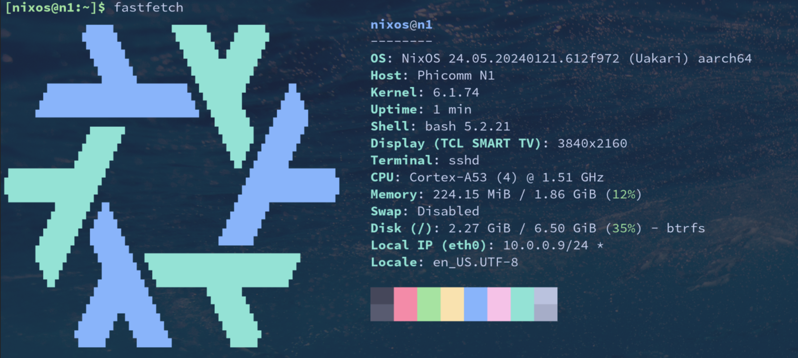

## 前言

原因在前一篇博客中已写，此处不再赘述。

## 制作U盘

可以在[hydra.nixos.org](https://hydra.nixos.org/job/nixos/trunk-combined/nixos.sd_image_new_kernel_no_zfs.aarch64-linux)页面选择最新编译的镜像，比如：[nixos-sd-image-24.05pre574351.612f97239e2c-aarch64-linux.img.zst](https://hydra.nixos.org/build/247198377/download/1/nixos-sd-image-24.05pre574351.612f97239e2c-aarch64-linux.img.zst)，解压后DD到U盘。我是自己通过`NixOS`自编译的镜像，包含了`nixos-install-tools`等必要工具，使用官方镜像自行安装应该差不多。
```bash
zstd -d nixos-sd-image-24.05pre574351.612f97239e2c-aarch64-linux.img
sudo dd if=nixos-sd-image-24.05pre574351.612f97239e2c-aarch64-linux.img of=/dev/sda status=progress
```
把[u-boot-2015-phicomm-n1.bin](u-boot-2015-phicomm-n1.bin)镜像写入到U盘，并避免覆盖第445至512字节，这是储存MBR的分区表的位置
```bash
sudo dd if=u-boot-2015-phicomm-n1.bin of=/dev/sda conv=fsync,notrunc bs=1 count=444
sudo dd if=u-boot-2015-phicomm-n1.bin of=/dev/sda conv=fsync,notrunc bs=512 skip=1 seek=1
```

## U盘启动

如果EMMC可正常引导，那么插入U盘后通电，盒子会正常启动并引导U盘，`NixOS`镜像会卡在"Starting kernel ..."很长时间，**要有足够耐心等待**。前面的步骤无误，是可以进入系统的。

## nixos-install

进入系统后，挂载EMMC。
```bash
mount /dev/mmcblk1p2 /mnt
mount /dev/mmcblk1p1 /mnt/boot
```
保留[emmc_autoscript](emmc_autoscript)和[uboot](uboot)，这两个是启动引导文件，如果缺失会永久停留在欢迎界面，其他文件可以全部删除。
然后下载`Phicomm N1`相应的`NixOS`配置文件，可参考我的配置[nixos](https://github.com/ZenQy/nixos)，然后进行安装。
```bash
sudo nixos-install --root /mnt --flake .#n1
```

## 启动新系统

关机后断电，然后拔出U盘后通电，盒子会启动进入`NixOS`系统。


